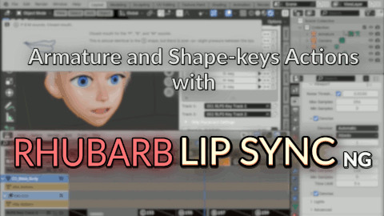

# Rhubarb Lip Sync NG - Blender plugin

## Video tutorials

### Quick Intro

### Combining Armature Actions with Shape Keys

## Installation

### Blender 4.2+
Install as a Blender extension. Download the file for your platform from the link below, and simply drag and drop the `.zip` file into the Blender window.

| Platform | Release Link |
|----------|--------------|
| 🪟 Windows | [Download](https://github.com/Premik/blender_rhubarb_lipsync_ng/releases/download/v1.5.0/rhubarb_lipsync_ng-Windows-1.5.0.zip) |
| 🍏 macOS  | [Download](https://github.com/Premik/blender_rhubarb_lipsync_ng/releases/download/v1.5.0/rhubarb_lipsync_ng-macOS-1.5.0.zip)  |
| 🐧 Linux  | [Download](https://github.com/Premik/blender_rhubarb_lipsync_ng/releases/download/v1.5.0/rhubarb_lipsync_ng-Linux-1.5.0.zip)   |

| [🪟 Windows](https://github.com/Premik/blender_rhubarb_lipsync_ng/releases/download/v1.5.0/rhubarb_lipsync_ng-Windows-1.5.0.zip) | [🍏 macOS](https://github.com/Premik/blender_rhubarb_lipsync_ng/releases/download/v1.5.0/rhubarb_lipsync_ng-macOS-1.5.0.zip) | [🐧 Linux](https://github.com/Premik/blender_rhubarb_lipsync_ng/releases/download/v1.5.0/rhubarb_lipsync_ng-Linux-1.5.0.zip) |
|----------|--------------|------|

  
 <b>Was the addon installed successfully?</b> 

  
1. Go to the [releases page](https://github.com/Premik/blender_rhubarb_lipsync_ng/releases/latest) and download the `rhubarb_lipsync_ng<your_system>*.zip` file to your PC. For example: `rhubarb_lipsync_ng-Windows-1.5.0.zip` for Windows.

2. Run Blender, go to the `Main menu/Edit/Preferences/Addons`. Click the **Install** button (top right) and select the downloaded zip file (don't unzip the file).

3. After a short moment, the plugin will install and show up. **Enable the plugin** by ticking the checkbox in front of the plugin name.

4. Verify the `rhubarb` executable is working by pressing the **Check rhubarb version** button. Note the plugin wraps the executable from the [rhubarb-lip-sync](https://github.com/DanielSWolf/rhubarb-lip-sync) project.

Note: Generally, each time you see a button is disabled, hover the mouse cursor over the button and a popup will show the reason.

## Quick start

### Create Capture

1. There should now be a new ***RLSP*** tab visible in the 3D view with two panels. First, create a new `Capture` in the current scene by pressing the **Create capture** button in the `RLSP: Sound setup and cues capture` panel.

1. Select a sound file.
   * Note the plugin can convert sound files to the supported formats.
   * For a better experience: Enable `Audio Scrubbing` `Cache` and `Sync to Audio`.
   * Optionally, place the `sound strip` in the `Sequencer` by pressing the **Place as Strip** button. You can set the start frame here, but if you change the start frame later, you need to remove the strip and place it again.

1. Press the **Capture** button. The list of Cues should get populated. Note:
   * The capture task runs in the background, so you can still use Blender while it is running. You can even create and run another capture(s) concurrently. However, pressing `Esc` will cancel the running operator.
   * The underlying `rhubarb cli` is also able to utilize multiple threads, but only for longer sound clips. It runs single-threaded for short sounds.
   * There are additional capture options available when pressing the small `⌄` button beside the `Capture` button, such as extended-shapes usage or **Dialog file**. The dialog file is a sound transcription that can improve accuracy, but only works for English.

1. You can preview the captured cues by clicking on the cue lists. Too short or too long cues are highlighted in red. You can also start playback, and the small icon will follow the cues. However, there is probably some refreshing bug, and sometimes the icon doesn't refresh unless the mouse cursor is moving over the panel.

### Map cues to Actions

1. Open the other panel `RLSP: Cue mapping and baking` and select the `Object` you want to animate. For bone animation, select an armature. For shape-key animation, select a mesh.

1. For each `Cue type`, select the appropriate Action. Note:
   * Use the `?` button to show a hint about the expected mouth shape (copied from the `rhubarb-cli` page).
   * Usually, your `Actions` would have a single keyframe on the first frame (a.k.a. pose). But multi-frame actions are supported as well.
   * It is possible to map the same `Action` to multiple `Cue types`. For instance `A` and `X`.
   * Using `Action-sheet` where multiple cues are on different frames of the same `Action` is supported too. Use the custom frame range button to select the desired (sub)range:

     

   * There are action-filters available that can be used to narrow down the selection in the dropdowns. Use this, for instance, if all your poses are flagged as an asset. Or if you want to make invalid Actions (with a missing key) show up as well.

     

1. Select or create `NLA Track`. For 2D animation use a single track. But for 3D **two tracks** are preferable since it allows the placed `Action strips` to interleave and fluently blend their influence.

   

1. You can tweak the `Strip placement settings`. For 2D animation the `In Out Blend Type` should be `No Blending`

   

### Bake to NLA

1. Press the big **Bake to NLA** button. This will bring up an additional dialog with a few more baking options and information:

   

   * Select the `Capture` (cue list) to be baked. It matches the one selected earlier in the `RLSP: Sound setup and cues capture` panel. Note it is possible to bake multiple Captures and bake them one-by-one reusing the same mapping.
   * You can again set/change the `Start Frame` here.
   * The `Object to bake` option indicates which `Objects` should be considered for baking. By default, all `Objects` with non-empty mapping will get baked at once. For example, there could be mapping on the Armature with the basic animation. Additionally, there could be mapping on the mesh with some corrective shape-key Actions. Or it could be useful where there are separate Objects for the tongue and teeth.

1. Review errors/warnings and press the **Ok** button. Note:
   * The baking might still work even with some errors/warnings.
   * If you are repeating the bake,press the **Remove strips** button to remove the previously baked `Actions` and make room for new `Strips`.

1. After the baking is done, review the baking report. The report is shown only when there were any baking errors/warnings.

### Tweak the Action Strips

1. Open the `NLA Editor`. You can tweak the position/length/blending of the `NLA Strips`. Some default Strip properties can be changed in the `Strip placement settings` section. However, the `Bake to NLA` would have to be run again (removing the existing `Strips` first).

1. Hint: In Blender, it is possible to change a property of multiple objects at once. For instance, to enable auto-blending on all strips:
   * Select all the strips in the NLA (press the `a` key).
   * `2x Shift-click` any of the already selected strips again to make it active. This should show the side panel.
   * `Alt+click` the `Auto Blend In/Out` to distribute the change to all the selected strips.

### Bake to Single Action
If needed, the `NLA Tracks` can be baked into a single new `Action`. Note, if you have both a normal-action track pair and a shapekey-action track pair, they have to be baked one-by-one.

1. Select the Armature and go to `Pose mode` (for normal-action tracks).
1. Select the Bones you want to bake. For example, press `a` to select all.
1. Select the strips in the NLA track you want to bake. Use the `b` key and box-select strips if you don't want to include all tracks.
1. Then go to `NLA Editor/main menu/Edit/Bake Action`.
1. Consider checking the `Visual Keying` and `Clean Curves` options:

A new `Action` will be created and selected in the `Action Editor`. The two RLPS tracks can now be disabled or removed (mouse-hover on the track name and press `x`).

## More details

- [FAQ](faq.md)
- [Troubleshooting Guide](troubleshooting.md)

### Supported Blender versions

Any Blender version newer than **v3.2**. Test results:

| Version      | System  | Total | Passed | Failed | Errors | Skipped | Status |
|--------------|---------|-------|--------|--------|--------|---------|--------|
| **4.2.1** LTS| Windows | 44    | 42     | 0      | 0      | 2       | ✔️     |
| **4.1**.1    | Windows | 44    | 42     | 0      | 0      | 2       | ✔️     |
| **4.0**.2    | Windows | 44    | 42     | 0      | 0      | 2       | ✔️     |
| **3.6**.13   | Windows | 44    | 42     | 0      | 0      | 2       | ✔️     |
| **3.5**.1    | Windows | 44    | 42     | 0      | 0      | 2       | ✔️     |
| **3.4**.1    | Windows | 44    | 42     | 0      | 0      | 2       | ✔️     |
| **3.3**.20   | Windows | 44    | 42     | 0      | 0      | 2       | ✔️     |
| **3.2**.2    | Windows | 44    | 33     | 7      | 2      | 2       | ❌     |
| **3.1**.2    | Windows | 44    | 33     | 7      | 2      | 2       | ❌     |
| **3.0**.1    | Windows | 44    | 33     | 7      | 2      | 2       | ❌     |

## Contributions

* Inspired by the [scaredyfish/blender-rhubarb-lipsync](https://github.com/scaredyfish/blender-rhubarb-lipsync).
* The underlying engine [rhubarb-lip-sync project.](https://github.com/DanielSWolf/rhubarb-lip-sync)
