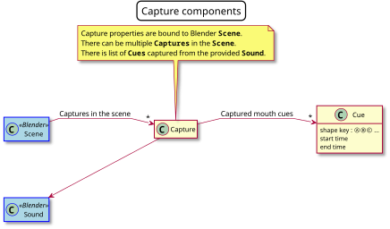

# Random dev notes


https://docs.pytest.org/en/7.1.x/explanation/goodpractices.html#src-layout

```sh

source /opt/mambaforge/etc/profile.d/conda.sh
```

https://github.com/DanielSWolf/rhubarb-lip-sync

## Diagrams

Some diagrams

| Preview                                  | Click to View                |
|------------------------------------------|------------------------------|
| <a href="doc/diagrams/capture.svg"></a> | <a href="doc/diagrams/capture.svg">svg</a>|
| <a href="doc/diagrams/mapping.svg"></a> | <a href="doc/diagrams/mapping.svg">svg</a> |


## License
`# SPDX-License-Identifier: MIT`

## Conda

### Create

Create blank env with only python/pip.

```sh
mamba create -n rhubarb -c conda-forge python=3.10 pip~=22.2 
```

Then Activate and Update the env (see below)
Note it seems it has to be done in two steps. Since the base(system) python and pip would have been used to install the dependencies instead.

### Activate

```sh
conda activate rhubarb
which python # Verify it points somewhere like `.conda/envs`. Not to the system python.
```

### Update

Activate the env first. The `--prune` is only needed if deps. were removed/renamed. Note the  `-f environment.yml` is used implicitly.
```sh
mamba env update --prune
```

### Win
Install: https://mamba.readthedocs.io/en/latest/installation.html#windows

```sh
set MAMBA_ROOT_PREFIX=r:\mm

micromamba shell init -s cmd.exe -p R:\mambaPrefix
micromamba shell hook --shell=cmd.exe
micromamba env list
micromamba create -f environment.yaml
micromamba activate rhubarb

r:\mambaPrefix\Scripts\activate
```

## Release

- Verify the rhubarb binary versions+hashes are the latest version available
- `cd scripts`
- `python rhubarb_bin.py` to download rhubar binaries and verify the checksums. It would also deploy the correct binary to the /bin folder based on the current platform (linux/mac/win).
- `python package.py` to create zipped distributions for each platform.


## Vs Code
Probably the easiest is to run the `code` or `code-oss` from within the activated conda env.
Then run `Python: Select Interpreter` and select the one from conda env.

### Pylance

```json
    "python.analysis.diagnosticSeverityOverrides": {
        "reportOptionalMemberAccess": "none",
    }
```

Already in `project.toml`. To add to the settings.json manually:
```json
 "python.formatting.provider": "black",
 "python.formatting.blackArgs": ["--line-length", "160", "--skip-string-normalization"],
 "python.formatting.blackPath": "/bin/black",
```

### bpy modules

[Fake bpy modules](https://github.com/nutti/fake-bpy-module) (seems more complete)
```json
    "python.autoComplete.extraPaths": [
        "/data/src/fake_bpy_modules_3.4-20230117"
    ],
    "python.analysis.extraPaths": [
        "/data/src/fake_bpy_modules_3.4-20230117"
    ],
```

Official bpy from pip:
```json
"python.autoComplete.extraPaths": [
        "/home/premik/.conda/envs/rhubarb/lib/python3.10/site-packages/bpy/3.4/scripts/modules/"
    ],
    "python.analysis.extraPaths": [
        "/home/premik/.conda/envs/rhubarb/lib/python3.10/site-packages/bpy/3.4/scripts/modules/"
    ],
```

Debug: https://github.com/JacquesLucke/blender_vscode
https://marketplace.visualstudio.com/items?itemName=JacquesLucke.blender-development


## Blender

###
For operator bl_idname, the same naming conventions as in 2.7x remain
Registration: Menu, Panel, Header, UIList, Operator
`UPPER_CASE_{SEPARATOR}_mixed_case` The separator for each identifier is listed below:
* Header -> _HT_
* Menu -> _MT_
* Operator -> _OT_
* Panel -> _PT_
* UIList -> _UL_

Valid Examples:
* `class OBJECT_OT_fancy_tool (and bl_idname = "object.fancy_tool")`
* `class MyFancyTool (and bl_idname = "MYADDON_MT_MyFancyTool")`
* `class SOME_HEADER_HT_my_header`
* `class PANEL123_PT_myPanel (lower case is preferred but mixed case is supported).`

https://wiki.blender.org/wiki/Reference/Release_Notes/2.80/Python_API/Addons#Registration

bpy.ops.sound.open(filepath='/tmp/work/1.ogg')

Uilist:
https://blender.stackexchange.com/questions/30444/create-an-interface-which-is-similar-to-the-material-list-box/30446#30446
https://blender.stackexchange.com/questions/8699/what-ui-would-work-for-choosing-from-a-long-long-list
https://blender.stackexchange.com/questions/717/is-it-possible-to-print-to-the-report-window-in-the-info-view

https://blender.stackexchange.com/questions/44356/fighting-split-col-and-aligning-row-content
https://sinestesia.co/blog/tutorials/using-uilists-in-blender/

Icons:
https://wilkinson.graphics/blender-icons/

Best practice:
https://docs.blender.org/api/current/info_best_practice.html


Properties
https://docs.blender.org/api/blender_python_api_master/bpy.props.html?highlight=floatproperty#get-set-example

## Todo

### High
* Offline doc:
  * Image width
  * Fix the video tutorials links, drop or fix the grid view
  * Drop author from title page (pdf)  

* Mapping wizards
  * Clear - will remove the mapping (delete from the object completly?)
  * Face-it - From Test rig - Normal actions+shape-key corrections? 2) From shape-key test action 3) The final control rig (doesn't need a wizard)
  * By name - More instances (alow user defined) - will map action by matching name patterns (should provide some placeholder/expansions in the expression for objectName, etc)

## Multi character/dialogs workflow
  * Start-frame 
     - [x] Sync from SoundStrip 
     - [x] Sync from start-frame to SoundStrip
     - [x] Include channel number to the Capture and StripName? Also to the Capture name?
  * Workflow from Sequencer 
    - [ ] Make a Capture operation dialog (now only confirmation)
    - [ ] Put the dialog-file, recognizer
    - Make the Capture of selected Sound strip visible in the Sequence editor's N panel 
      -  [ ] - button to create capture from the Script, will turn to button select the capture from the Script (when already has one)
    - [ ] "Capture source is" drop-down in this new Capture Op dialog:
       - [ ] The sound of the selected
       - [ ] Selected SoundStrips in Video sequences
       - [ ] All Sounds without Capture
       - [ ] All SoundStrips without capture
    - [ ] Check box - regenerate existing Captures
    - [ ] Ordering - Selection order/SoundStrip start time/Channel-Start Time
    - [ ] Number of parallel processed = 1
  - [ ] Paste sound_strip first, create captures of them and render to NLA
  * Bake to NLA - batchmode?
    - There should be an option to bake multiple captures of the (selected/all objects). Based on the channel or othe crit. So bake can be done 1x for each single character.
    


### Normal
* `is_fcurve_for_shapekey` 
  - there is actually better way, the Action has targe_type/id or similar 
  - Add support for other action types , like material/shader graph
  - Refacotr the action filtering toolbar, have the action-types like a dropdown with checkable action types,
* In prefs, when executable doesn't exist make the control red
* Integrate with: https://mecabricks.com/en/shop/product/6
* Bring some of the old baking method back with fixed lengths

### Low
* Create aur package
* Add [speaker](https://docs.blender.org/manual/en/latest/render/output/audio/speaker.html) as an alternative to Sequencer audio clip
* The scaled down icons (32x32) still hard to see. Pre-scale different set icons?
* Verify the Dialog file is working
* When dialog file is specified but file doesn;t exists rhubar_cli ends with `error-code` but not much clue. Add check for dialog file.
* Change all labels cases to follow Blender style "Foo in Bar"
* Add some simple blender sample file
* There are still some ogg unsupported format - could have been an user error (ogg file was not really an ogg?)
* Integrate with Parrot lipsync backend (when already installed), or add new backend based on whisper or similar (onnx?)


## Check
https://github.com/Hunanbean/Papagayo-NGLipsyncImporterForBlender
https://blendermarket.com/products/syncnix
https://blendermarket.com/products/parrot-lipsync

## NLA

NLA object tracks:

```python
[t.name for t in C.object.animation_data.nla_tracks]
```

NLA shape-key tracks:

```python
[t.name for t in C.object.data.shape_keys.animation_data.nla_tracks]
```

### Depsgraph updates:


```python

def on_depsgraph_update_post(scene, depsgraph):
    """
    Checks if relevant data (sequences) have been updated.
    """
    # Check if any Sequence data block was updated. This is more direct.
    #print_update_properties(scene)
    #print_update_properties(depsgraph)    
    sequence_updated = False
    for update in depsgraph.updates:
        #print(f"{dir(update)}")
        #print_update_properties(update)
        print(f"{update.id}\n")

bpy.app.handlers.depsgraph_update_post.append(on_depsgraph_update_post)
bpy.app.handlers.depsgraph_update_post.remove(on_depsgraph_update_post)
```


Nla track added/removed:
```
<bpy_struct, Scene("Scene") at 0x7015c03d3008, evaluated>
<bpy_struct, Object("Light") at 0x70166c0e3d08, evaluated>
<bpy_struct, Object("Camera") at 0x70166ea03f08, evaluated>
<bpy_struct, Object("Cube") at 0x7016f975d208, evaluated>
<bpy_struct, Object("Sphere") at 0x701716e8a208, evaluated>
```

 Strip moved: Only Scene
```


https://docs.blender.org/manual/en/latest/files/data_blocks.html
https://blenderartists.org/t/how-to-fix-blender-error-disabled-cant-edit-this-property-from-linked-data-block/1239469/3

Windows system console:
https://blender.stackexchange.com/questions/145890/where-is-the-system-console

https://download.blender.org/release/

```
class FaceitExpressions(PropertyGroup):
    '''Properties stored in each expression item'''
    name: StringProperty(
        options=set(),
    )
    side: StringProperty(
        options=set(),
    )
    frame: IntProperty(
        options=set(),
    )
    index: IntProperty(
        options=set(),
    )
    mirror_name: StringProperty(
        options=set(),
    )
    corr_shape_key: BoolProperty(
        name='Shape Key',
        description='Corrective Shape Key active on this expression',
        default=False
    )
    procedural: EnumProperty(
        name='Procedural Expression',
        items=PROCEDURAL_EXPRESSION_ITEMS,
    )

