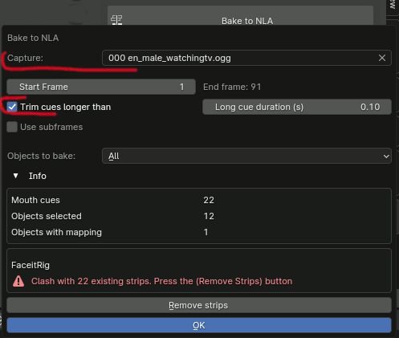

# Release Notes

## v1.6.0

**Date:** 2025-06-12

- There is now two-way **synchronization** between the `Sound Strip` in the `Sequencer` and the `Capture` object. The `Start Frame` updates as the `Strip` is being moved and vice versa. Can be enabled/disabled with the chain like button (enabled by default).

- The `NLA Track` selection dropdowns are now more robust and persists most of the NLA track modifications like track reordering renaming or deletions.

- Offline html/pdf documentation is included as a separate zip file.
---

## v1.5.4

**Date:** 2025-03-25

- Updated the plugin to work with Blender **v4.4**
- The `Use extended shapes` checkbox is now visible in both the Capture as well as the Mapping panel.

---

## v1.5.3

**Date:** 2025-03-09

**Maintenance Release**

- The `Remove previous strip` button has been moved to the error report section. An option to enable automatic removal has been added.  
- A new button has been added to manually or automatically unlink an Active Action (preview) before baking, addressing a common issue where the baked animation would not move.  
- Improved error handling for the `Object has no animation data` error on the preview buttons when using only Shape Key Actions.

---

## v1.5.2

**Date:** 2024-09-23

Fixed a regression where macos-arm64 was missing from the supported architectures in the extension manifest, causing installation failures on arm platform.

---

## v1.5.1

**Date:** 2024-09-20

Fixed legacy installation method broken in 1.5.0.

---

## v1.5.0

**Date:** 2024-09-17

- Can now be installed as a Blender **Extension**, while legacy addon installation is still supported.
- For **library overrides**, fixed the issue where Mapping items were lost on reload. The mapping [preinitialization-in-the-linked-library-workaround](https://github.com/Premik/blender_rhubarb_lipsync_ng/issues/7#issuecomment-1726421716) is no longer necessary.

---

## v1.4.0

**Date:** 2024-06-18

- Added `In Out Blend Type` to control Strip Blending, including new **No Blending** to better support 2D animations.

- The basic/non-extended shapes scenario now works correctly.
- Fixed the `'NoneType' object has no attribute 'fcurve'` error.
- Fixed the `'NoneType' object has no attribute 'sequences_all'` error for some scenes.

---

## v1.3.1

**Date:** 2024-05-27

Bugfix release for missed import #15

---

## v1.3.0

**Date:** 2024-05-25

- **New simplified bake-to-NLA which should produce better results out-of-the-box**.
- After the too-long cues are trimmed down the gap is filled with the `X` cues (silence)
- The scene end frame is updated if the sound strip reaches after the last frame of the scene.
- For troubleshoting: starting `blender --debug` will force trace level debugging of the plugin. Enabled console logging where missing before

---

## v1.2.1

**Date:** 2024-04-11

Bug fix release
* Mapping preview button works correctly also with shape-key Actions
* Baking multiple objects at once correctly alternate between the two track-pairs

---

## v1.2.0

**Date:** 2024-03-30

### Capture
- Import/Export captured Cues to json file (mainly used by unitests )

### Mapping
- Mapping preview button. Activates the mapped Action on the selected object(s) or all the objects which have mapping.
- A custom frame-range on the mapped Action can be configured. So it is now possible to use ***pose-sheets*** and it is no longer necessary to slice individual poses out into individual Actions. Like for example the `overwrite_shape_action` from the `Faceit` plugin. This is also prerequisite for more automated Faceit integration (wip).

### NLA Bake dialog
- Caputre selection can be now changed directly on the bake dialog.
- Auto-trim too long Cues on the NLA baking. Enabled by default with some reasonable time.

### Other
- Several small UI changes and reorganization
- Unittests on Github works for all three platforms

---

## v1.1.1

**Date:** 2024-01-08

Bug fix release: the Action dropdown was failing silently where there was any blank Action #8

---

## v1.1.0

**Date:** 2024-01-02

- The dialog file is automatically used if there is `.txt` file beside the `wav/ogg` file. See #7
- **Up to date** check button in the preferences:

- Baking **Shape-keys** is now supported.
  - For Armature use normal Actions
  - For Mesh use Shape-key Actions

- Mapping section of the panel has been reorganized.
  - Cue-type help button has been moved to the left (click on the A,B,C symbols)
  - Action dropdown is now filtered based on the Flags in the "toolbar". Shape/Normal Actions, Assets only, Only Valid/Matching Actions

---

## v1.0.3

**Date:** 2023-10-09

Improved logging (log to file)

---

## v1.0.2

**Date:** 2023-10-02

Capture doesn't work for longer sounds clips fix (#8)

---

## v1.0.1

**Date:** 2023-09-19

Library overrides support

---

## v1.0.0

**Date:** 2023-09-13

- Attempt to add library overrides support #7 
- Tab name `RLSP` in the 3d view sidebar can now be changed in the preferences

---

## v0.9.1

**Date:** 2023-07-10

Bugfix release, removed stalled imports

---

## v0.9.0

**Date:** 2023-07-06

- Project renamed to `rhubarb_lipsync_ng` as there was nothing left from the original code-base. The versioning was reset as well.
- The Action baking somehow works now. But the Strip Placement needs a rework. Especially the strip-ends placing. Baking of the shape keys actions is not implemented yet.
- Captures are now bound to `Scene` and only Mapping-settings are bound to individual `Object(s)` (typically armature). So one capture can be used for multiple objects and baked at once.
- Setting the start frame works as expected. 
