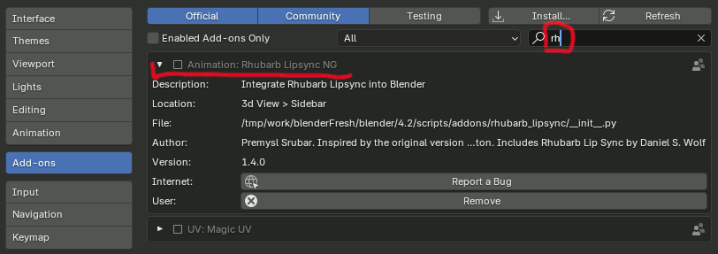
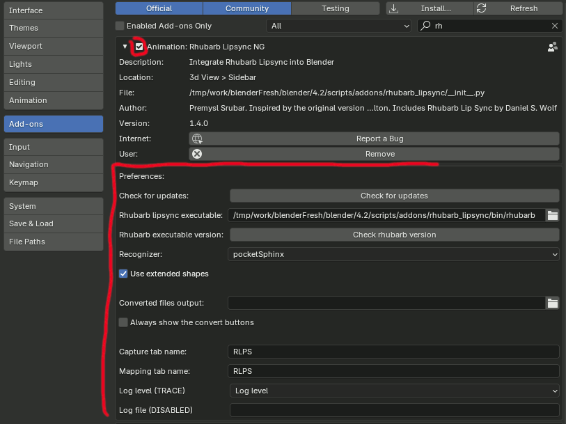
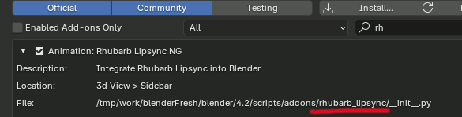
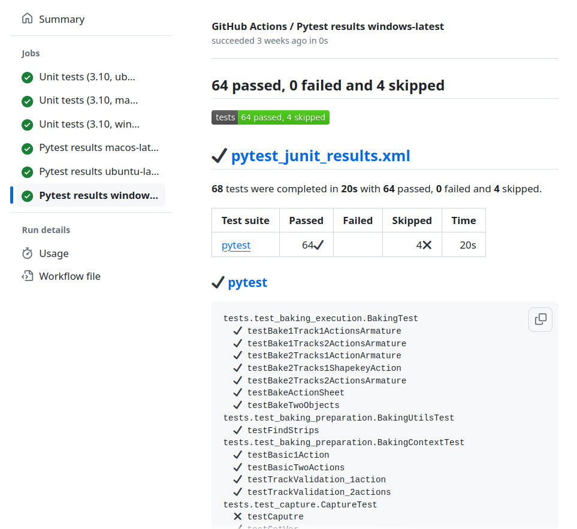

# Basic Addon Troubleshooting Guide

## Determine at Which Stage the Problem Occurs

<details>
  <summary> <b>Was the addon installed successfully?</b> </summary>


When the addon is installed from the `zip` file, it should show up in the preferences:

- Go to `Main menu/Edit/Preferences/Add-ons`
- Search for the addon by name. Type `rh` into the search box

If you can see the Animations: Rhubarb Lipsync NG item, the plugin has been installed successfully, and you can proceed to the next section.



If the installation failed:
- Ensure the Blender version is compatible with the addon version. Each Blender version comes with its own Python version, and older versions might not work.

- Verify the addon `zip-file` used for the installation is correct. Make sure you have downloaded the correct zip file (and not, for instance, a source snapshot). Don't unzip the file. Ensure the file is not corrupted due to a download error.
There could be problems accessing the `addons` folder, such as permission issues.


- Try to [fully reinstall the addon](#reinstalling-the-addon).
- Try to [collect debug messages](#collecting-debug-messages-for-console) to find the root cause or any additional details.
- Search [existing tickets](https://github.com/Premik/blender_rhubarb_lipsync_ng/issues?q=), including the closed ones. Maybe somebody had similar issue before.
- Report the [bug](https://github.com/Premik/blender_rhubarb_lipsync_ng/issues/new/choose)

---

</details>

<details>
  <summary> <b>Was the addon enabled/registered successfully?</b> </summary>

After the addon is installed, it should get registered. This happens after the addon is enabled in the preferences:

- Again, go to `Main menu/Edit/Preferences/Add-ons`
- Search for the addon by name. Type `rh` into the search box
- Check the checkbox in front of the addon name.

If no errors are shown and you see the addon preferences below the addon details, then the addon has been registered/enabled successfully. Proceed to the next section.



When the addon fails to install or register, Blender often shows a popup with a Python error and stack trace. Unfortunately, this error is often generic and not useful. For example:

```
AttributeError: partially initialized module 'rhubarb_lipsync' has no attribute 'blender' (most likely due to a circular import)
```

The actual useful error details (root cause) might have been printed earlier to the system console.

---

</details>

## Enable Verbose Log Messages

Collecting log messages before an issue happens is very useful for further troubleshooting. There are two options for enabling verbose logging:

1. [Start Blender with the debug flag from shell/console](#collecting-debug-messages-for-console). This is the only option if the plugin won't install/register.
1. Set the log verbosity and log file in the addon preferences:


## Reinstalling the Addon

Sometimes, when there is an unexpected error, the addon classes might still be registered in memory even though the addon is disabled/removed. Until Blender is restarted, try the following steps:

- Disable the addon by unchecking it in the preferences.
- Click the Remove button to make Blender delete the addon.
- Restart Blender by closing and reopening it.
- Install and enable the addon again.


If still no luck, ensure there are no files left over after the addon was removed. 
Sometimes Blender fails to properly remove the addon files when the plugin is uninstalled, for example, when some file is locked by the OS or because of a bug. The addon could then be in a strange state where it won't show up in the addons list, but there might still be some files on the disk.

To recover, try the following steps:
- First, make sure the addon is removed and doesn't show up in the addon list in the preferences.
- Stop Blender.
- Navigate to the [Blender's user folder](https://docs.blender.org/manual/en/latest/advanced/blender_directory_layout.html) inside your home folder. Then go to the `scripts/addons` subfolder.
- Inspect the `addons` folder content. If you see any  `rhubarb_lipsync` folder or files, **remove them** completly.
- You can also easily find the path in the addon preferences page in the `File:` label:



- Start Blender.
- Install and enable the addon again.

If still no luck, follow the next section and run Blender with a fresh profile.

## Run Blender with a Fresh Profile (Factory Settings)

In some rare circumstances, there could be interference with other add-ons or Blender customizations that might be causing troubles. To rule this possibility out, start Blender with factory settings. This can be done by setting some environment variables to a temporary folder so your original profile can be left intact.

On Windows:

```sh
set BLENDER_USER_RESOURCES=%TEMP%
blender --debug
```

On Linux/Mac:

```sh
XDG_CONFIG_HOME="/tmp/blenderFresh" blender --debug
```

Then install the plugin as usual.


## Collecting Debug Messages for Console

Start Blender with the `--debug` flag. This will make the addon to log additional information to the console at the very early stage of registration. This might contain crucial clues about why the issue is happening or at least help narrowing it down. You can also add `--debug-python` to get even more details related to addon registration and Python in general.

```sh
> blender --debug
Switching to fully guarded memory allocator.
Blender 3.5.1
Build: 2023-04-24 23:56:35 Windows release
argv[0] = C:\Program Files\Blender Foundation\Blender 3.5\blender.exe
argv[1] = --debug
Read prefs: C:\users\premik\AppData\Roaming\Blender Foundation\Blender\3.5\config\userpref.blend
```

Note there might be some additional log lines, for example, messages from other plugins.

```sh
addon_utils.disable: rhubarb_lipsync not disabled
Modules Installed (rhubarb_lipsync) from 'C:\dist\rhubarb_lipsync_ng-Windows-1.3.1.zip' into 'C:\users\premik\AppData\Roaming\Blender Foundation\Blender\3.5\scripts\addons'
```

```sh
RLPS: enter register()
RLPS: enter init_loggers()
Added console handler on 15 loggers.
RLPS Set TRACE level for 16 loggers
Added console handler on 0 loggers.
RLPS: exit register()
Warning: This script was written Blender version 4.0.2 and might not function (correctly), though it is enabled
```

```
Traceback (most recent call last):
  File "/usr/share/blender/4.2/scripts/startup/bl_operators/userpref.py", line 692, in execute
    _module_filesystem_remove(path_addons, f)
  File "/usr/share/blender/4.2/scripts/startup/bl_operators/userpref.py", line 52, in _module_filesystem_remove
    shutil.rmtree(f_full)
  File "/usr/lib/python3.11/shutil.py", line 744, in rmtree
    onerror(os.path.islink, path, sys.exc_info())
  File "/usr/lib/python3.11/shutil.py", line 742, in rmtree
    raise OSError("Cannot call rmtree on a symbolic link")
OSError: Cannot call rmtree on a symbolic link
```

- Search [Opened issues](https://github.com/Premik/blender_rhubarb_lipsync_ng/issues?q=is%3Aopen). Maybe somebody has already reported the same issue.
- Also search already [Closed issues](https://github.com/Premik/blender_rhubarb_lipsync_ng/issues?q=is%3Aclosed). There might be a similar issue with a solution from the past.

- The addon has several automated unit tests and integration tests. Those verifies the basic addon operators in a headless Blender (Blender as module) environment. Tests are ran automatically after each change on GitHub for all three supported platforms. You can see them on the [Github Actions](https://github.com/Premik/blender_rhubarb_lipsync_ng/actions/workflows/unit-tests.yml). There shouldn't be any tests failing.



